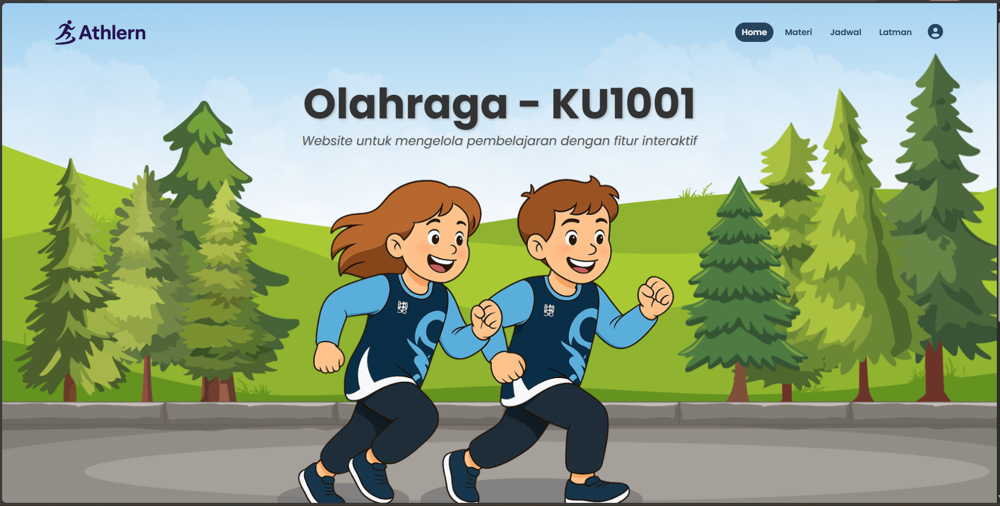
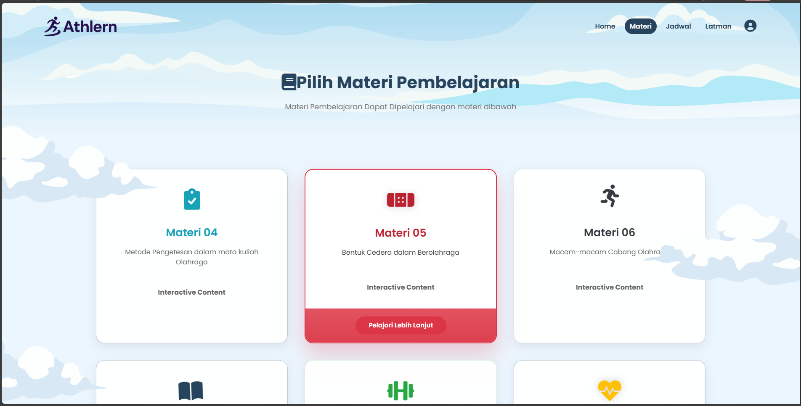
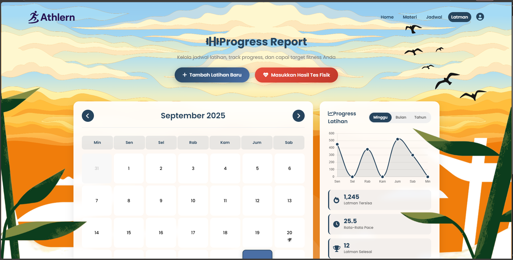
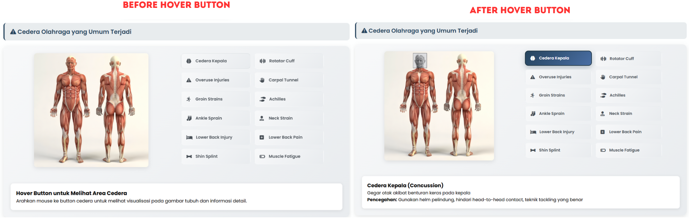
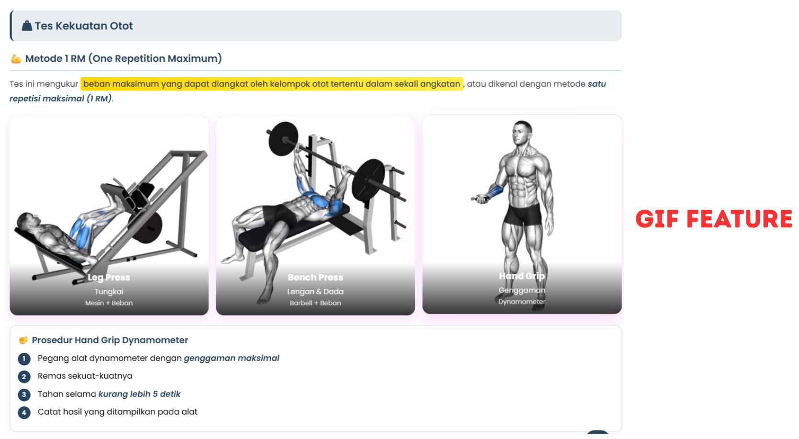
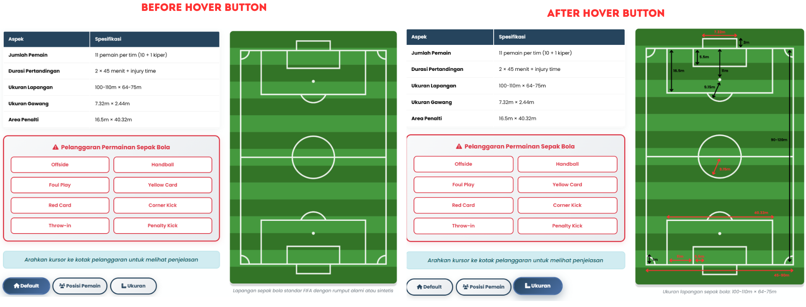
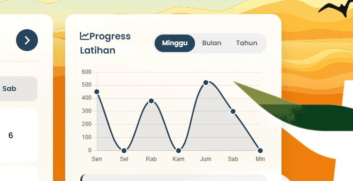

# 🏃‍♂️ Athlearn: Interactive Sport Website

<div align="center">


**Platform Pembelajaran Olahraga Interaktif untuk Mata Kuliah KU1001**

[](https://tugas-kecil1-pengembangan-aplikasi.vercel.app/)
[](https://github.com/NakeishaValya/TugasKecil1-PengembanganAplikasiWebDanMobile-II3140)

</div>

---

## 📋 **Deskripsi Proyek**

**Athlearn: Interactive Sport** adalah platform pembelajaran olahraga berbasis web yang dirancang khusus untuk mendukung mata kuliah **KU1001 - Olahraga** di lingkungan perguruan tinggi. Website ini mengintegrasikan teknologi web modern dengan pendekatan pembelajaran interaktif untuk menciptakan pengalaman edukatif yang komprehensif dan engaging.

### 🎯 **Tujuan Utama**
- Digitalisasi pembelajaran mata kuliah olahraga
- Menyediakan materi interaktif dan mudah dipahami
- Sistem manajemen jadwal yang terpusat dan real-time
- Platform tracking latihan mandiri (Latman) yang akurat
- Interface yang responsive dan user-friendly

---

## ✨ **Fitur Utama**

### 🏠 **Homepage - Landing Page**

*Landing page dengan parallax scrolling dan interactive navigation*

### 📚 **Halaman Materi**

*Overview 6 modul pembelajaran dengan visual cards*

### 📅 **Sistem Jadwal**

*Timeline interface dengan info boxes dan background scrollable animation*

### 🏃 **Latihan Mandiri (Latman)**

*Dashboard tracking dengan Chart.js visualization*

### 👤 **Profile System**
*Interactive profile dropdown dengan user information dan settings panel*

---

## 🎯 **Fitur Interaktif Unggulan**

### 📖 **Materi 04: Anatomi Otot - Interactive Muscle Map**


**Fitur Interaktif:**
- **🖱️ Hover Effects:** Muscle groups highlight saat di-hover
- **📍 Click Detection:** Klik pada muscle area untuk detail information
- **🔍 Zoom Functionality:** Zoom in/out untuk detail anatomy
- **📊 Information Panels:** Dynamic info panels dengan muscle details
- **🎨 Color Coding:** Different colors untuk muscle categories

### 🏋️ **Materi 05: Teknik Olahraga - Exercise Simulator**


**Fitur Interaktif:**
- **▶️ GIF Controls:** Play/pause controls untuk exercise animations
- **⏱️ Timer Integration:** Built-in timer untuk exercise duration
- **📈 Progress Tracker:** Real-time tracking exercise repetitions
- **🎯 Form Checker:** Visual feedback untuk proper exercise form
- **📝 Instructions Toggle:** Expandable instruction panels

### 📊 **Materi 06: Assessment & Evaluation - Interactive Dashboard**


**Fitur Interaktif:**
- **📊 Dynamic Charts:** Real-time Chart.js visualizations
- **🎚️ Progress Bars:** Animated progress indicators
- **📈 Performance Analytics:** Interactive data filtering
- **🎯 Goal Setting:** Adjustable target parameters
- **📋 Report Generation:** Export functionality untuk progress reports

---


## 🎮 **Interactive Demos**

### 🎨 **Parallax Animation System**

*Multi-layer parallax scrolling effects pada homepage*

### 📊 **Chart.js Interactive Demo**


*Interactive Chart.js features dengan hover dan click events di Latman dashboard*


---

## 🚀 **Installation & Setup**

```bash
# Clone repository
git clone https://github.com/NakeishaValya/TugasKecil1-PengembanganAplikasiWebDanMobile-II3140.git

# Navigate to project directory
cd TugasKecil1-PengembanganAplikasiWebDanMobile-II3140

# Open in browser (or use Live Server in VS Code)
open index.html
```
---

Link Deployment : [Disini](https://tugas-kecil1-pengembangan-aplikasi.vercel.app/)*
Link Deployment : [Disini](https://tugas-kecil1-pengembangan-aplikasi.vercel.app/)*

## �🛠️ **Teknologi yang Digunakan**
### **Frontend Stack**


### **Libraries & APIs**


### **Development & Deployment**


![Vercel](https://img.shields.io/badge/Vercel-000000?style=for-the-badge&logo=vercel&logoColor=white

---

**II3140 - Pengembangan Aplikasi Web dan Mobile**

*© 2025 Athlearn: Interactive Sport. All rights reserved.*
